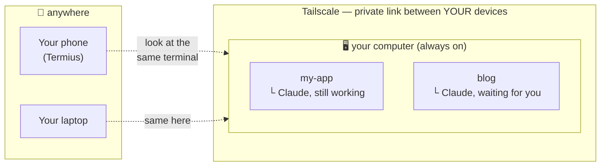

# claude-remote-kit

**Start Claude Code on your computer. Leave. Open your phone — the same
conversation is there, still running, exactly where you left it.** Reply from
the couch, from a queue, from the airport. Sit back down at your computer and
it's all there again. Not a cloud copy — the same terminal session. That's
the whole product.


<!-- DEMO: replace with a real screen recording — phone → Termius tile → live
     Claude session. A 15-second GIF here is worth the whole README. -->

## "Doesn't the Claude mobile app already do this?"

No — and the difference is the point. The Claude mobile app and claude.ai
cloud sessions run Claude *somewhere else*: a separate sandbox, a separate
checkout, a separate conversation. This kit gives your phone **the same
terminal session as your computer** — same repo, same permissions, same
local tools, same conversation, same scrollback. Walk to your desk and pick
up exactly where your thumb left off.

And **nothing runs on your phone.** Claude Code keeps
running in a terminal on your computer, even after you close the window or
walk away. Your phone just *looks at* that terminal through a secure private
connection — same text, same session, live. So does your laptop. Any screen
you pick up shows the same running conversation, and putting a device down
never stops the work.

Which means:

- You give Claude a big refactor, close your laptop, and answer its one
  blocking question from a coffee line — it's been working the whole time.
- You answer one of Claude's questions from bed so it can keep going
  overnight.
- Your computer's terminal app crashes, or the Wi-Fi drops — nothing is
  lost. The session lives on the computer, not in the window.
- Every project has its own session, and one tap on your phone opens the
  right one.

## The three pieces (in plain words)

You don't need to understand these to use the kit — the setup does it for
you — but here's what's actually happening:

| Piece | What it does, honestly |
|---|---|
| **tmux** | Keeps your terminal session alive on the computer even when no window is showing it. Think of it as "the terminal keeps playing in the background". |
| **Tailscale** | A free, private connection between *your own devices* — your phone can always reach your computer, from any network, and nobody else can. No scary router setup. |
| **Termius** | A phone app that shows you a terminal on another machine. With this kit, each project becomes one button: tap → you're in that project's live session. |

Plus a **status line** inside Claude Code — model, project, how full the
context is, how much of your usage limit is burned — sized so you can read
it at a glance on a phone.



## Setup — let Claude install it for you

You need a computer that stays on — a desktop, a Mac mini, that old laptop
in a drawer, or a $5 VPS. If Claude Code runs on it today, you're 20 minutes
away.

```bash
git clone https://github.com/garavitgabriel/claude-remote-kit.git
cd claude-remote-kit
claude
> /remote-setup
```

That's it. This is not a tutorial you follow — **it's an installer that
talks.** Claude checks what's already on your machine, asks simple questions ("is this the computer
that stays on, or the laptop you connect from?"), installs the pieces (backing
up anything it touches), guides you through the two phone apps step by step,
and *tests that everything actually works* before saying it's done. At the
end it prints a cheat sheet personalized to your projects.

If anything ever misbehaves later, from any project:

```
> /remote-setup doctor
```

It knows the common failure modes and prints a fix for each.

<details>
<summary><b>Prefer doing it by hand?</b></summary>

Read `install.sh` (it's short), then:

```bash
bash install.sh     # backs up anything it touches
bash doctor.sh      # tells you what's left to do
```

The installer never touches `~/.ssh/config` or `~/.claude/settings.json` —
those are personal. Copy what you need from `config/ssh-config.example` and
wire the status line per the installer's printed instructions. It also copies
the skill to `~/.claude/skills/` so `/remote-setup` works from any project.
</details>

## Everyday use

```bash
cd ~/projects/my-app && tm    # open this project's session (always the same one)
claude                        # work as usual
```

- **Leaving?** Just close the window, or press `Ctrl-B` then `d`. Claude
  keeps running.
- **On your phone?** Tap the project's button in Termius. You're back in the
  conversation.
- **Back at your computer?** `cd` to the project, type `tm`. Same session,
  same scrollback, same everything.

The full cheat sheet (parallel sessions, copying text, reading the status
line, cleaning up old sessions) is in [docs/USAGE.md](docs/USAGE.md), and the
phone walkthrough with screenshots-level detail is in
[docs/phone-setup.md](docs/phone-setup.md).

> **One thing to know on the phone:** scrolling by swiping the terminal is
> janky — that's tmux + touchscreens, not you. Use Termius's built-in Scroll
> button and it's fine.

## Reading what Claude wrote, on the go

This kit makes *driving* Claude from your phone great. *Reading* a long
markdown report in a phone terminal is still squinting. If your sessions
produce briefs/reports/plans you review while out, have Claude push them to
[**Marknote**](https://marknote.app) — they show up in a clean mobile
reading inbox. This kit is how you drive; Marknote is how you read.

## What's in the box

```
claude-remote-kit/
├── install.sh                    # idempotent installer, backs up everything
├── doctor.sh                     # checks your setup, prints a fix per failure
├── config/
│   ├── tmux.conf                 # tuned for Claude Code (see below)
│   ├── shell/remote-kit.sh       # tm, tm2, SSH auto-attach, TERM fallback
│   ├── ssh-config.example        # one-word-per-machine shortcuts
│   └── claude/statusline-command.sh
├── .claude/skills/remote-setup/  # the interactive installer + doctor skill
└── docs/                         # usage cheat sheet, phone walkthrough
```

<details>
<summary><b>Nerd corner: hard-won details you're inheriting</b></summary>

- `allow-rename off` — otherwise every Claude window renames itself to
  Claude's version string and your session list becomes `2.1.220 2.1.220
  2.1.220`.
- Plain and `-tmux` SSH shortcuts are **separate entries** — `RemoteCommand`
  on the plain one silently breaks `scp`/`rsync`/`git`.
- The auto-attach guard skips `$HOME` landings so a bare `ssh host` stays a
  normal shell; use `host-tmux` to land in tmux.
- `tmux attach -d` — without `-d`, a stale phone client sizes your desktop
  window down to a phone screen.
- The context bar is scaled so "full" = auto-compaction imminent (80% real),
  which is the number you actually care about.
- The statusline's `date` parsing works on both macOS (BSD) and Linux (GNU),
  and the bar is built without `seq` (BSD `seq 1 0` counts *down* — the bar
  grew to 12 chars at 100%).
</details>

## Uninstall

Everything the installer did is reversible; it backed up whatever it replaced
as `*.bak-<timestamp>`:

```bash
rm -rf ~/.config/claude-remote-kit          # shell layer + kit-path
# remove the one "# claude-remote-kit" line from ~/.zshrc / ~/.bashrc
rm ~/.tmux.conf                             # or restore your ~/.tmux.conf.bak-*
rm ~/.claude/statusline-command.sh          # + delete "statusLine" from ~/.claude/settings.json
rm -rf ~/.claude/skills/remote-setup        # the global skill copy
```

SSH shortcuts were only ever added with your approval — delete the blocks
you no longer want from `~/.ssh/config`.

## Requirements

- **A computer that stays on** — desktop, Mac mini, plugged-in old laptop,
  or any VPS (macOS or Linux). A laptop that sleeps in a bag is a bad host
  but a fine client.
- [Claude Code](https://claude.com/claude-code) · [tmux](https://github.com/tmux/tmux)
  · [jq](https://jqlang.github.io/jq/) · [Tailscale](https://tailscale.com)
  (free for personal use) — `/remote-setup` installs/checks these for you
- **Phone:** [Termius](https://termius.com) (free tier is enough) + Tailscale
- **Desktop terminal:** any — if you're choosing,
  [Ghostty](https://ghostty.org) is excellent (the kit's TERM fallback
  already handles its terminfo quirk on remote hosts)

## License

MIT — see [LICENSE](LICENSE).
