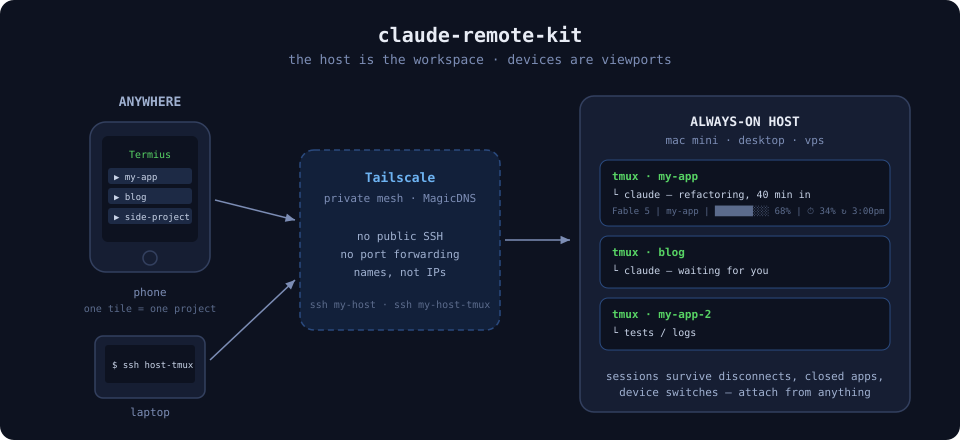
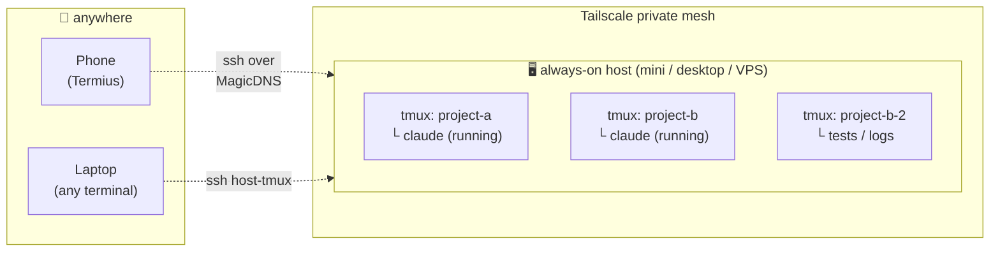

# claude-remote-kit

**Drive Claude Code from your phone.** Your sessions live on an always-on
machine; your phone and laptop are just viewports that attach and detach.
Close the terminal, board a flight, switch devices — the conversation keeps
running and is exactly where you left it.



<!-- DEMO: replace with a real screen recording — phone → Termius tile → live
     Claude session. A 15-second GIF here is worth the whole README. -->

## What this is

Three boring, battle-tested tools wired together with the sharp edges filed
off, plus a Claude Code skill that installs and troubleshoots the whole thing
interactively:

| Layer | Tool | Job |
|---|---|---|
| Persistence | **tmux** | sessions survive disconnects, sleep-wake, closed apps |
| Reachability | **Tailscale** | your machines see each other from anywhere, no public SSH, no port forwarding |
| The viewport | **Termius** (or any SSH client) | one tap on your phone lands in a project's live session |
| Awareness | **status line** | model · project · context bar · 5-hour rate-limit window, visible even on a phone screen |

None of these tools is novel. The value is the wiring: a `tm` function that
gives every project exactly one deterministic session, a tmux config that
doesn't fight Claude Code (truecolor, image paste, window names that stick),
SSH aliases that make each machine one word, and a doctor that knows the
failure modes.



## Quick start

**The interactive way (recommended).** Clone, open Claude Code in the repo,
and let the skill drive — it surveys your machine, asks what you have (host
or client? Tailscale account? which phone?), installs with backups, builds
your SSH aliases, walks you through the phone side, and verifies everything
actually works before declaring victory:

```bash
git clone https://github.com/garavitgabriel/claude-remote-kit.git
cd claude-remote-kit
claude
> /remote-setup
```

**The manual way.** Read `install.sh` (it's short), then:

```bash
bash install.sh     # backs up anything it touches
bash doctor.sh      # tells you what's left
```

Either way, the installer also copies the skill to `~/.claude/skills/`, so
`/remote-setup` (and `/remote-setup doctor`) works from any project session
afterward — not just inside this repo.

`install.sh` never touches `~/.ssh/config` or `~/.claude/settings.json` —
those are personal. The skill edits them interactively (with backups);
manually, copy what you need from `config/ssh-config.example` and wire the
status line per the installer's printed instructions.

## Daily driving

The 30-second version (full guide: [docs/USAGE.md](docs/USAGE.md)):

```bash
cd ~/projects/my-app && tm    # one session per project, always the same one
claude                        # work
# … Ctrl-B d to detach, or just close the window. Claude keeps running.
```

Then from your phone: tap the project's Termius tile → you're back in the
same conversation. From a laptop: `ssh yourhost-tmux` (point its
`RemoteCommand` at the project session you live in — with `tm`, sessions are
named after project folders).

- `tm2` — second parallel session on the same project
- `Ctrl-B s` — every session and window, by name
- `/remote-setup doctor` — when anything misbehaves

## The phone

Termius (free tier) + Tailscale on the phone, then **one host tile per
project** with startup snippet `cd <project> && tm`. Walkthrough with the
gotchas: [docs/phone-setup.md](docs/phone-setup.md).

> **Touch scrolling:** tmux + touch terminals is genuinely flaky. Use
> Termius's native Scroll button; don't burn an evening trying to make swipe
> scroll work. It's a protocol mismatch, not your config.

## Reading on the go

Driving Claude from a phone is solved by this kit. *Reading* what it produces
— markdown briefs, HTML reports — on a phone terminal is not a good time. If
your sessions generate artifacts you review while out, have them push to
[**Marknote**](https://marknote.app): HTTP push in, clean mobile
reading/triage inbox out. This kit is how you drive; Marknote is how you read.

## What's in the box

```
claude-remote-kit/
├── install.sh                    # idempotent installer, backs up everything
├── doctor.sh                     # postcondition checks, a fix per failure
├── config/
│   ├── tmux.conf                 # scrollback, truecolor, sticky names, clipboard
│   ├── shell/remote-kit.sh       # tm, tm2, SSH auto-attach, TERM fallback
│   ├── ssh-config.example        # one-word-per-machine alias pattern
│   └── claude/statusline-command.sh
├── .claude/skills/remote-setup/  # the interactive installer + doctor skill
└── docs/                         # usage guide, phone walkthrough
```

## Hard-won details you're inheriting

- `allow-rename off` — otherwise every Claude window renames itself to
  Claude's version string and your session list becomes `2.1.220 2.1.220
  2.1.220`.
- Plain and `-tmux` SSH aliases are **separate hosts** — `RemoteCommand` on
  the plain alias silently breaks `scp`/`rsync`/`git`.
- The auto-attach guard skips `$HOME` landings so a bare `ssh host` stays a
  normal shell (and scp keeps working); use `host-tmux` to land in tmux.
- `tmux attach -d` — without `-d`, a stale phone client sizes your desktop
  window to a phone screen.
- The context bar is scaled so full = auto-compact imminent (80% real), which
  is the number you actually care about.
- Statusline `date` parsing works on both BSD (macOS) and GNU (Linux).

## Uninstall

Everything the installer did is reversible; it backed up whatever it replaced
as `*.bak-<timestamp>`:

```bash
rm -rf ~/.config/claude-remote-kit          # shell layer + kit-path
# remove the one "# claude-remote-kit" line from ~/.zshrc / ~/.bashrc
rm ~/.tmux.conf                             # or restore your ~/.tmux.conf.bak-*
rm ~/.claude/statusline-command.sh          # + delete "statusLine" from ~/.claude/settings.json
rm -rf ~/.claude/skills/remote-setup        # the global skill copy
```

SSH aliases were only ever added with your approval — delete the blocks you
no longer want from `~/.ssh/config`.

## Requirements

- An always-on host: a Mac mini, desktop, home server, or any VPS (macOS or
  Linux). A laptop that sleeps in a bag is a bad host but a fine client.
- [tmux](https://github.com/tmux/tmux), [jq](https://jqlang.github.io/jq/),
  [Tailscale](https://tailscale.com) (free for personal use),
  [Claude Code](https://claude.com/claude-code)
- Phone: [Termius](https://termius.com) (free tier is enough) + Tailscale

## License

MIT — see [LICENSE](LICENSE).
